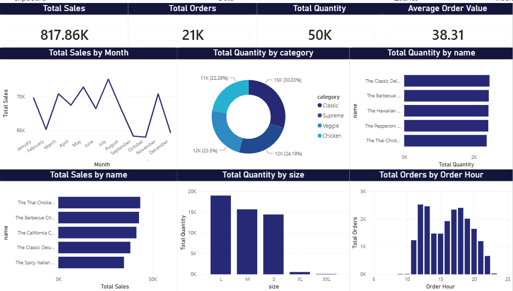
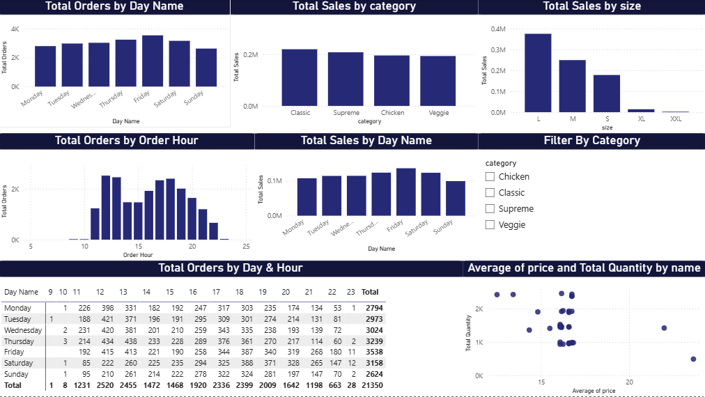

# 🍕 Pizza Sales Analysis Dashboard

An interactive Pizza Sales Analysis Dashboard built using Microsoft Power BI.

## 📊 Project Overview

This project analyzes pizza sales data to understand sales performance, customer ordering patterns, popular pizza products, categories, sizes, and order timing.

## 🎯 Key Analysis

- Total Sales
- Total Orders
- Total Quantity Sold
- Average Order Value
- Monthly Sales Trends
- Sales by Pizza Category
- Sales by Pizza Size
- Top Pizza Products
- Orders by Day of the Week
- Orders by Order Hour
- Day & Hour Order Analysis using Matrix
- Interactive Date and Category Filters

## 🛠️ Tools & Skills

- Power BI
- DAX
- Power Query
- Data Cleaning
- Data Modeling
- Data Visualization
- Dashboard Design

## 📈 Dashboard

The Power BI dashboard provides an interactive view of pizza sales performance and helps identify important sales and ordering patterns.

## 📁 Project File

The complete Power BI project file is available here:

**Pizza_Sales_Analysis.pbix**

## 👨‍💻 Author
Safiullah Amjad
## 📊 Dashboard Preview

### Page 1

### Page 2

